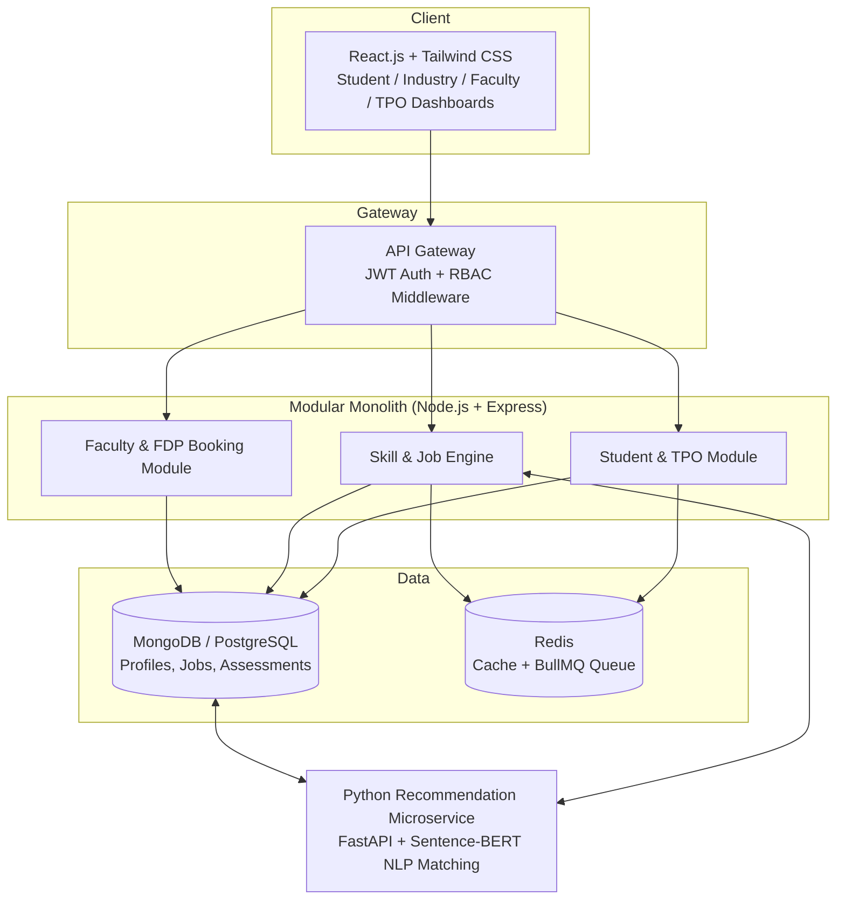
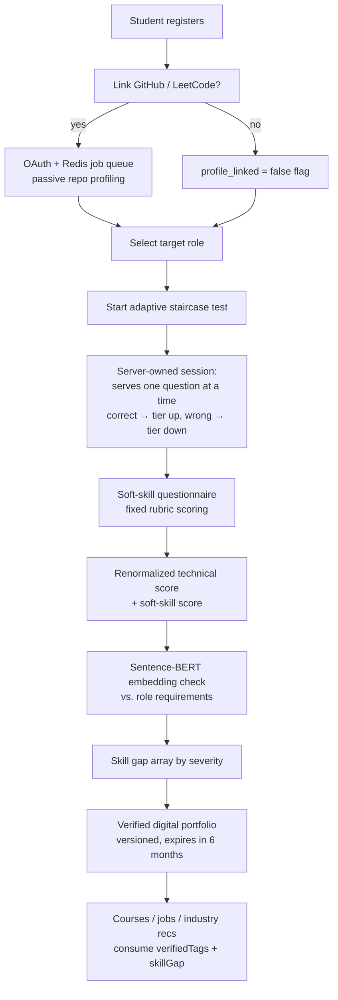
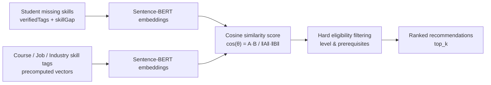
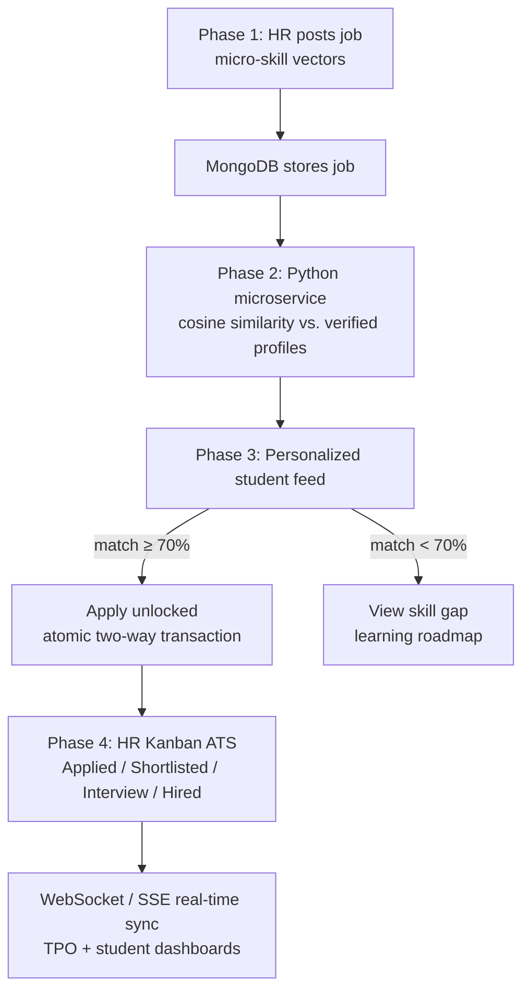
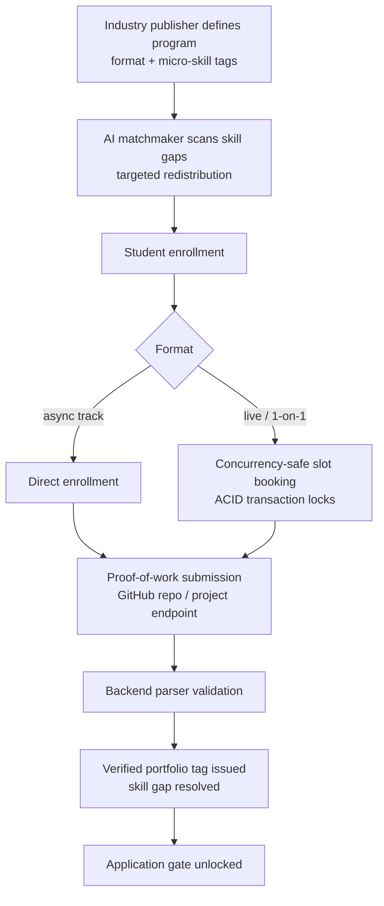
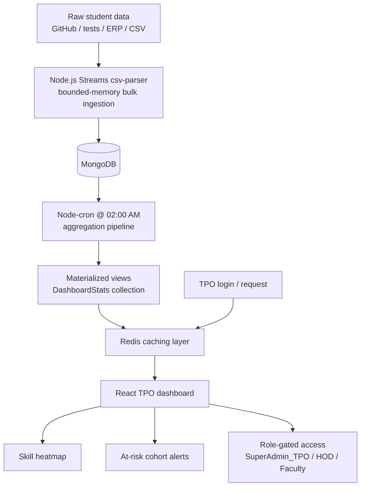

# Academia–Industry Collaboration Portal

A unified, intelligent platform that connects **students, industries, academicians, and institutions** to close the gap between academic learning and industry requirements — from skill assessment and personalized upskilling through internships, placements, and institutional analytics.

Built as a submission design for the **Smart India Hackathon (SIH)** problem statement.
This repository contains the full **problem analysis, feature architecture blueprints, and worked examples** for the solution.

---

## 1. Overview

Students graduate without knowing which micro-skills the industry actually demands, industries struggle to find verified, job-ready candidates, and academicians lack structured pathways to practical industry exposure. The ecosystem today is fragmented across disconnected platforms — one for learning, one for internships, one for portfolios, one for placements.

This portal solves it with a single unified data architecture: a student's **skill assessment output feeds directly into job, course, and industry recommendations**, and every acquired skill is **verified and tracked** so that industries hire from a pre-filtered, trustworthy talent pipeline.

### Problem Statement

The official SIH statement describes a significant gap between the skills acquired in academic institutions and the competencies expected by industries, with no unified platform to connect the three key stakeholders. The solution must support the complete lifecycle of:

- **Skill Development** — assessment, skill profiling, personalized learning recommendations, career guidance, verified digital portfolios.
- **Internship** — centralized posting, skill-based matching, application tracking, faculty internships & FDPs.
- **Placement** — job posting, recommendation engine, shortlisting, recruitment management, analytics dashboards.

The full official statement is available in [`problem analysis/SIH_official_problem.md`](problem%20analysis/SIH_official_problem.md).

---

## 2. High-Level System Architecture



Why this design: a **modular monolith** keeps the core CRUD fast to build (Node.js), while the **CPU-bound AI matching** is isolated in a dedicated Python microservice (FastAPI + Sentence-BERT) — clean separation of concerns that demonstrates production-grade architecture within hackathon timelines. See [`problem analysis/architecture_ and_ techStack.md`](problem%20analysis/architecture_%20and_%20techStack.md).

---

## 3. Feature Modules

### 3.1 Dynamic Skill Assessment Engine

Students are evaluated through a **staircase-style adaptive test** (per-subtopic difficulty tiers) combined with **passive code profiling** of linked GitHub/LeetCode profiles, a rubric-scored soft-skill questionnaire, and anti-cheat signals. Scoring is renormalized across available signals so every student is scored fairly, and the output is a **verified skill profile** with a severity-ranked skill gap array.



Docs: [`features/skill_assesment.md`](features/skill_assesment.md) · [`examples/skill_assessment_example.md`](examples/skill_assessment_example.md)

### 3.2 AI-Driven Skill Mapping & Recommendations

Standard string-matching fails on semantic relationships (a search for "Node.js" won't match an "Express.js" course). The Python microservice embeds skills with **Sentence-BERT**, computes **cosine similarity**, applies hard eligibility filters, and returns ranked recommendations — one pipeline serving three targets: skill development programs, job roles, and target industries.



Docs: [`features/skill_mapping.md`](features/skill_mapping.md)

### 3.3 Intelligent Internship & Job Marketplace

A closed-loop talent pipeline. Industries post opportunities tagged with **micro-skill vectors**, the matching engine pre-sorts a personalized feed, and the **Apply action is algorithmically gated** (match ≥ 70% unlocks "Apply"; below that, students get a targeted skill-gap roadmap). Applications execute as **two-way atomic transactions**, and an HR **Kanban ATS** syncs status changes to TPO and student dashboards in real time.



Docs: [`features/internship_&_job_opportunity.md`](features/internship_&_job_opportunity.md)

### 3.4 Industry Learning Programs (Upskilling Bridge)

Transforms passive content consumption into **verifiable skill acquisition**. Programs are micro-skill tagged and AI-distributed to students with the matching gap. Live slots are protected by **ACID transaction locks**, and completion requires **action-gated proof of work** (e.g., a GitHub repo that a backend parser validates) before a verified skill tag is issued and application gates unlock.



Docs: [`features/industry_learning_Program.md`](features/industry_learning_Program.md)

### 3.5 Institutional Analytics & TPO Dashboard

Shifts institutional reporting from reactive ("who got placed?") to **predictive**. Bulk student data (ERP/GitHub/CSV) is streamed into MongoDB with bounded memory, a **nightly cron** materializes aggregation views cached in Redis, and TPOs get sub-50ms dashboards with a **skill heatmap** and an **at-risk cohort pipeline** that flags cohorts lagging on skills required by upcoming recruiters — enabling early, targeted intervention.



Docs: [`features/TPO_dashboard_architect.md`](features/TPO_dashboard_architect.md)

---

## 4. Tech Stack

| Layer | Technology | Key Purpose in the Portal |
| --- | --- | --- |
| **Frontend Framework** | **React.js (Vite)** + **Tailwind CSS** | Isolated dashboards for Student, TPO, Industry, and Faculty roles. |
| **Core Backend** | **Node.js** + **Express.js** | API routing, RBAC, authentication, CRUD, atomic transactions. |
| **AI / Matching Engine** | **Python (FastAPI)** | Sentence-BERT embedding + cosine similarity between profiles and opportunities. |
| **Primary Database** | **MongoDB** (or PostgreSQL) | Flexible user profiles, micro-skill matrices, dynamic job postings. |
| **Cache & Queue** | **Redis** + **BullMQ** | High-frequency search caching; rate-aware background job processing. |
| **Analytics & UI Charts** | **Recharts** / **Chart.js** | Placement readiness and skill metrics on TPO dashboards. |
| **Real-Time Sync** | **WebSockets / Socket.io / SSE** | Live ATS status updates to student and TPO dashboards. |
| **Media / File Storage** | **Cloudinary** / **AWS S3** | Resumes, certificates, completion reports. |

---

## 5. Repository Structure

```
research of SIH/
├── README.md                          ← you are here
├── problem analysis/
│   ├── SIH_official_problem.md        Official SIH problem statement & expected solution
│   ├── problem_research.md            Domain research: stakeholders, pain points, gaps, constraints
│   ├── compititors.md                 Why existing platforms fail & innovation space
│   └── architecture_ and_ techStack.md  System architecture blueprint & tech stack
├── features/
│   ├── skill_assesment.md             Dynamic adaptive assessment engine blueprint
│   ├── skill_mapping.md               AI skill-mapping & recommendation microservice
│   ├── internship_&_job_opportunity.md  Intelligent job/internship marketplace & ATS
│   ├── industry_learning_Program.md   Industry learning programs & upskilling bridge
│   └── TPO_dashboard_architect.md     Institutional analytics & TPO dashboard
└── examples/
    └── skill_assessment_example.md    Worked example of the staircase adaptive test
```

---

## 6. Status

**Phase: Research & Design.** The repository currently contains the complete problem analysis, architecture blueprints, and worked examples. Production implementation has not yet started — the docs are structured to be directly implementable as a MERN-stack platform with a Python AI microservice.